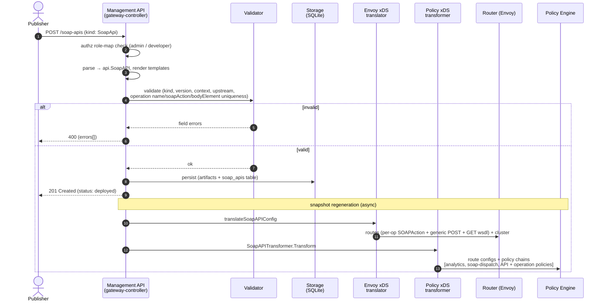
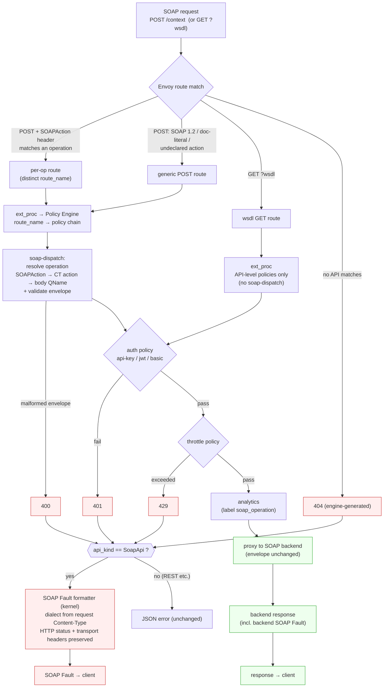

# SOAP API Support — Design Document

> ⚠️ **DESIGN-REVIEW UPDATE (supersedes parts of this document).** A review simplified the
> Phase 1 model: **operation awareness was removed**. The `soap-dispatch` policy is deleted,
> `SoapApi` resources no longer declare `operations`, and a SOAP API is now a **single
> wildcard POST resource** (plus a GET route for WSDL) that proxies all traffic to the
> backend — i.e. the §11 "single wildcard" model, minus per-operation policies. A new
> **`soap-wsdl-rewrite`** response-body policy rewrites backend URLs in returned WSDL/XSD to
> the gateway URL (auto-attached to the GET route, toggled by `spec.rewriteWsdl`, default on).
> The SOAP Fault formatter (§5.6) is unchanged. Sections describing per-operation routing
> (§5.2 per-op routes, §5.4 soap-dispatch, §5.5 operation analytics, the bodyElement parts of
> §5.1, D3/D8/D12/D13, §5.8 flows) reflect the **previous** model and are pending a rewrite.

| | |
|---|---|
| **Status** | Phase 1 implemented; **routing model simplified to single wildcard resource per design review** (operation awareness removed). Integration tests & doc refresh pending (Step 6) |
| **Scope** | WSO2 API Platform Gateway only (gateway-controller, router/Envoy, policy-engine) |
| **Related** | [Implementation walkthrough](soap-api-implementation.md) · [Implementation plan](soap-api-support-plan.md) · [Testing plan](soap-api-testing-plan.md) |

---

## 1. Problem

The WSO2 API Platform gateway manages REST, WebSub, WebBroker, MCP, and LLM APIs, but has
**no support for SOAP services**. Enterprises migrating from WSO2 API Manager — where SOAP
passthrough APIs are a long-standing feature — cannot front their existing SOAP backends
(ERP, banking, government, B2B integrations) with the new gateway. They need the same
gateway capabilities REST APIs enjoy — authentication, authorization, rate limiting,
analytics — applied to SOAP traffic.

SOAP cannot simply be deployed "as a REST API" because its HTTP binding violates three
assumptions the gateway's REST model is built on:

1. **One endpoint, one verb.** A SOAP service exposes a single URL and (almost) always
   uses `POST`. The gateway's routing unit — one Envoy route per `(method, path, vhost)` —
   collapses to a single route per service, defeating per-operation policies, throttling,
   and analytics.
2. **The operation lives in the message, not the URL.** A SOAP operation is identified by
   the `SOAPAction` HTTP header (SOAP 1.1), the `action` parameter of the
   `application/soap+xml` Content-Type (SOAP 1.2), or the qualified name of the first child
   of the SOAP `<Body>` (document/literal dispatch).
3. **Errors must be SOAP Faults.** The gateway emits JSON error bodies
   (`{"error":"Unauthorized"}`) for auth/throttle/routing failures. SOAP clients cannot
   consume these; they expect a `<soap:Fault>` envelope with the matching XML content type.

Additionally, Envoy (the gateway's data plane) has no native SOAP awareness — there is no
upstream precedent to adopt; SOAP support must be composed from HTTP routes and the
gateway's own policy engine.

## 2. Goals

Phase 1 (this design):

- **G1 — SOAP passthrough (SOAP-to-SOAP):** expose a SOAP service through the gateway,
  proxying envelopes to the backend unchanged.
- **G2 — first-class `SoapApi` resource:** full CRUD via the gateway management REST API,
  consistent with `RestApi` (validation, persistence, status, API keys).
- **G3 — policy reuse:** existing HTTP-transport policies (api-key-auth, basic-auth,
  jwt-auth, rate limiting, subscription validation, analytics) work on SOAP APIs without
  modification.
- **G4 — per-operation granularity:** operation-level policies, throttling, and analytics
  labeling despite all operations sharing one URL.
- **G5 — SOAP-correct error behavior:** every gateway-generated error (auth 401, throttle
  429, engine 500, malformed request 400) is returned as a SOAP Fault in the dialect the
  client used.
- **G6 — WSDL retrieval:** `GET <endpoint>?wsdl` passthrough to the backend.

## 3. Non-Goals (deferred)

| Deferred item | Rationale | Target |
|---|---|---|
| **WSDL import** (parse WSDL → generate `SoapApi`) | Authoring concern. The gateway never parses OpenAPI for REST either — `platform-api`'s `POST /import/openapi` does, then pushes a declarative resource. WSDL import is the exact SOAP analog and belongs in `platform-api`. | platform-api, later phase |
| **SOAP-to-REST transformation** (JSON facade over SOAP backends) | Requires WSDL-derived per-operation transformation templates. The existing `json-xml-mediator` policy is the building block. | Phase 2 |
| **WS-Security** (UsernameToken / X.509 / SAML in the SOAP header) | Requires a new body-parsing auth policy. HTTP-transport auth covers the common deployment patterns. | Phase 2 |
| **XSD / WSDL message validation** | Analogous to `json-schema-guardrail`; needs schema storage. Phase 1 validates envelope well-formedness only. | Phase 2 |
| **WSDL rewriting/serving by the gateway** (`<soap:address>` pointing at the gateway) | Phase 1 forwards `?wsdl` to the backend without parsing or storage. | Phase 2 option |
| **MTOM / SwA attachments, SOAP-over-JMS** | Out of scope. | — |
| **Per-operation routing for SOAP 1.2 / doc-literal** | The 1.2 action lives inside the Content-Type header and doc/literal carries no action header; matching either in Envoy is fragile. These requests use the generic route (operation still resolved for analytics). The wildcard model (§11) removes this gap entirely. | §11 / Phase 2 |
| **Sandbox upstream for SOAP** | Schema reserved (`upstream.sandbox`), not wired. | Later |

## 4. Background: the gateway architecture SOAP plugs into

```
API YAML ──> gateway-controller ──────────────────────────────┐
              parse → validate → store (per-kind DB table)    │
              │                                               │
              ├─► Envoy xDS (routes/clusters/listeners) ──► Router (Envoy)
              │     pkg/xds/translator.go  ("legacy path")    │   ext_proc
              │                                               ▼
              └─► Policy xDS (policy chains + route configs) ─► Policy Engine
                    transformer registry → RuntimeDeployConfig    (chains keyed
                    pkg/transform/* + pkg/policyxds/*              by route_name)
```

### 4.1 Component architecture

```mermaid
flowchart LR
    client["SOAP client / API publisher"]

    subgraph CP["platform-api &mdash; control plane (Phase 2)"]
      pa["POST /import-wsdl<br/>parse WSDL &rarr; declarative SoapApi"]
    end

    subgraph GC["gateway-controller"]
      direction TB
      mgmt["Management REST API<br/>/soap-apis + authz role map"]
      val["Validator<br/>validateSoapAPIConfiguration"]
      store[("Storage<br/>artifacts + soap_apis table")]
      exds["Envoy xDS translator<br/>translateSoapAPIConfig"]
      pxds["Policy xDS transformer<br/>SoapAPITransformer"]
      mgmt --> val --> store
      store --> exds
      store --> pxds
    end

    subgraph RT["Router (Envoy)"]
      direction TB
      rts["SOAP routes<br/>per-op SOAPAction / generic POST / GET wsdl"]
      epf["ext_proc filter"]
      rts --> epf
    end

    subgraph PE["Policy Engine"]
      direction TB
      sd["soap-dispatch<br/>operation resolution + envelope validation"]
      pol["auth / throttle / analytics policies"]
      ff["SOAP Fault formatter (kernel)"]
      als["Access Log Service"]
      sd --> pol --> ff
    end

    be["SOAP backend"]

    client -->|"deploy SoapApi (yaml/json)"| mgmt
    client -->|"SOAP invoke / ?wsdl"| rts
    exds -->|"routes + clusters (xDS gRPC)"| RT
    pxds -->|"policy chains + route configs (xDS gRPC)"| PE
    epf -->|"gRPC ext_proc (route_name)"| sd
    ff -->|"allow / SOAP Fault"| epf
    rts -->|"passthrough"| be
    rts -.->|"access logs"| als
    pa -.->|"declarative SoapApi (Phase 2)"| mgmt
```



The control plane (`platform-api`) is shown dotted because WSDL import is a Phase 2 concern
(§3); in Phase 1 the declarative `SoapApi` is authored directly against the gateway
management API. The two xDS streams from the controller are the crux: the **Envoy stream**
carries routes/clusters to the Router, and the **policy stream** carries policy chains +
route metadata (including `api_kind=SoapApi`) to the Policy Engine, joined at runtime by the
`route_name`.

Two facts discovered during implementation shape the whole design:

- **There are two parallel xDS planes keyed by the same `route_name` string.** Envoy
  routes carry a name (`METHOD|PATH|VHOST`); the policy engine receives that name via
  ext_proc (`xds.route_name`) and looks up its policy chain. Whatever discriminates routes
  on the Envoy side must produce matching keys on the policy side.
- **The Envoy route translator does not use the transformer registry** (its
  `SetTransformers` is never wired); REST routes come from the legacy `translateAPIConfig`
  path, while the transformer/`RuntimeDeployConfig` registry feeds *only* the policy xDS.
  A new kind therefore needs **both** a legacy Envoy translation function and a
  transformer.

## 5. Proposed Solution

### 5.1 Resource model — declarative `SoapApi` kind

A new artifact kind alongside `RestApi`, deliberately **declarative** (no WSDL parsing):

```yaml
apiVersion: gateway.api-platform.wso2.com/v1alpha1
kind: SoapApi
metadata:
  name: calculator-v1
spec:
  displayName: Calculator SOAP API
  version: v1.0
  context: /calculator/v1          # the single service endpoint on the gateway
  soapVersion: "1.1"               # "1.1" (default) | "1.2"
  upstream:
    main:
      url: http://backend:3002/calculator/v1/soap11
  policies:                        # API-level: apply to all operations
    - name: api-key-auth
      version: v1
      params: { key: X-API-Key, in: header }
  operations:                      # declared operations (optional for pure passthrough)
    - name: Add
      soapAction: "urn:Add"        # SOAP 1.1 action; "" valid for doc/literal
      policies:                    # operation-level policies
        - name: basic-ratelimit
          version: v1
          params: { limits: [ { requests: 100, duration: "1m" } ] }
    - name: Echo
      soapAction: "urn:Echo"
    - name: Subtract               # document/literal operation
      soapAction: ""               #   no SOAPAction
      bodyElement: SubtractRequest #   Body wrapper element (differs from the op name)
```

Unlike REST operations (`method` + `path`), SOAP operations are identified by `name` plus
either `soapAction` (RPC / SOAP-1.1-style dispatch) or `bodyElement` (the SOAP Body
wrapper element's local name, for document/literal dispatch where the wrapper name often
differs from the operation name). Operations are optional: a passthrough API with zero
declared operations routes everything through the service endpoint with API-level
policies. These three identifiers cover all of the SOAP binding's operation-dispatch
styles. The validator enforces uniqueness of `name`, and of each *non-empty* `soapAction`
and `bodyElement` (duplicates would route/dispatch ambiguously). The resource also mirrors
`RestApi` for the shared fields — `vhosts`, `subscriptionPlans`, `deploymentState`, API
keys, and the server-managed `status` block.

### 5.2 Routing — hybrid header-match + body-inspection

```
                         ┌──────────────────────────────────────────────────────┐
   POST /calculator/v1   │ per-op route: POST|/calculator/v1/|*|soapAction=Add  │
   SOAPAction: Add  ───► │  match: :method=POST + path + soapaction ~ ^"?Add"?$ │──► backend
                         │  chain: analytics, soap-dispatch, API-lvl, op-lvl    │
                         ├──────────────────────────────────────────────────────┤
   POST /calculator/v1   │ generic route:  POST|/calculator/v1/|*               │
   (1.2 / doc-literal /  │  match: :method=POST + path                          │──► backend
    undeclared action)──►│  chain: analytics, soap-dispatch, API-lvl            │
                         ├──────────────────────────────────────────────────────┤
   GET /calculator/v1    │ wsdl route:     GET|/calculator/v1/|*                │
   ?wsdl            ───► │  match: :method=GET + path  (query passes through)   │──► backend
                         │  chain: analytics, API-lvl   (no soap-dispatch)      │
                         └──────────────────────────────────────────────────────┘
```

- **Per-operation routes** (SOAP 1.1): each declared operation with a non-empty
  `soapAction` gets a dedicated Envoy route adding a `soapaction` header matcher with the
  regex `^"?<action>"?$` (clients send the value quoted or unquoted). A distinct route →
  a distinct `route_name` → a distinct policy chain, which is what makes per-operation
  policies/throttling work using **unmodified existing policies**.
- **Ordering is free:** the existing route sorter ranks routes with more header matchers
  above those with fewer at equal path specificity, so per-op routes win automatically.
- **Generic POST route** is the fallback for SOAP 1.2, doc/literal, and undeclared
  actions. The `soap-dispatch` policy resolves the operation from the message there, so
  analytics still label correctly; per-op *policies* don't apply on the fallback
  (documented limitation, see §3).
- **GET route** exists solely for `?wsdl`/`?xsd` passthrough — Envoy preserves query
  strings, so no query matching is needed.

> A simpler single-route alternative — one wildcard POST resource per SOAP API, with all
> per-operation behavior moved into the policy layer — is described in §11 as the suggested
> evolution of this model.

### 5.3 Policy architecture — reuse first

The central analysis: per-request concerns split into *transport-level* (work on any HTTP
traffic) and *operation-level* (need to know which SOAP operation is being invoked).

| Concern | Verdict | Mechanism |
|---|---|---|
| AuthN: api-key / basic / jwt | **Reused unchanged** | Read HTTP headers only |
| AuthZ: subscription validation | **Reused unchanged** | API-level |
| Throttling: API/app/IP level | **Reused unchanged** | Keyed on headers/auth context |
| Throttling: per-operation | **Reused unchanged** | Distinct per-op route → distinct chain |
| Analytics: API dimensions | **Reused unchanged** | System policy, kind-agnostic |
| Analytics: operation dimension | Small additions | `soap-dispatch` + ALS forwarding (§5.5) |
| Operation resolution | **New: `soap-dispatch` system policy** | §5.4 |
| SOAP Fault rendering | **New: kernel fault formatter** | §5.6 |

Only two genuinely new primitives were required; everything else is composition.

### 5.4 `soap-dispatch` system policy (new)

A compiled-in system policy (`wso2_apip_sys_soap_dispatch`) attached automatically to
every SOAP **POST** route by the SOAP transformer. Responsibilities:

1. **Operation resolution**, in order: `SOAPAction` header (quotes stripped) →
   Content-Type `action` parameter (SOAP 1.2) → local name of the first `<Body>` child
   (namespace-agnostic streaming XML scan). The resolved value is mapped to a declared
   operation's logical `name`: an action matches against declared `soapAction`s; a body
   element matches declared `bodyElement`s **first** (so a document/literal wrapper such as
   `SubtractRequest` resolves to operation `Subtract`), then falls back to matching the
   operation `name`. Undeclared operations pass through with the raw value — passthrough
   never rejects unknown operations.
2. **Publication:** writes `soap_operation`/`soap_action` into the shared policy context
   (for downstream policies) and analytics metadata, and sets the request's standard
   operation dimension (`SharedContext.OperationPath`).
3. **Envelope validation** (`validateEnvelope`, default on): malformed XML or a
   non-Envelope document is rejected with 400 — rendered as a SOAP Fault by §5.6.

It is **not** attached to the GET (`?wsdl`) route, whose empty body would fail envelope
validation. It is injected by the kind-aware SOAP transformer rather than the global
system-policy list (which has no notion of API kind).

### 5.5 Analytics — operation labeling

All SOAP operations share one URL, so the stock event's resource field (taken from the
request path) cannot distinguish them — the same problem MCP already solved. Following
that precedent:

- `soap-dispatch` sets `SharedContext.OperationPath` to the resolved operation (audited:
  consumed only by analytics metadata, tracing spans, and the Python policy bridge — never
  by routing), feeding the standard `x-wso2-operation-path` dimension.
- The Access Log Service forwards `soap_operation`/`soap_action` into
  `event.Properties["soapAnalytics"]` for `SoapApi` events — necessary because custom
  analytics keys are otherwise dropped before publishing.

The analytics *system policy itself required no changes.*

### 5.6 SOAP Fault formatter (new, policy-engine kernel)

A single formatting hook applied wherever the engine emits an immediate response — the six
policy short-circuit translation sites plus the two engine-generated error paths
(no-policy-chain 500, policy-execution 500). When the API kind is `SoapApi` and the status
is an error (≥400):

- The body is replaced with a SOAP Fault envelope; the original error body is preserved,
  escaped, inside `<detail>`.
- **The fault dialect is inferred per-request from the request Content-Type**
  (`application/soap+xml` → SOAP 1.2 `env:Sender`/`env:Receiver`; otherwise SOAP 1.1
  `soap:Client`/`soap:Server`). 4xx maps to Client/Sender, 5xx to Server/Receiver.
- **The HTTP status and transport headers are preserved** (401 keeps `WWW-Authenticate`,
  429 keeps `Retry-After`); only body + Content-Type change.
- Responses that already carry an XML body (a policy's hand-crafted fault) pass through
  untouched; non-SOAP API kinds are entirely unaffected.

Because the hook lives at the kernel layer, **every existing and future policy gets
SOAP-correct error behavior for free** — no per-policy changes.

### 5.7 WSDL handling

`GET <context>?wsdl` is proxied to the backend unchanged (no parsing, no storage, no
address rewriting in Phase 1). **WSDL retrieval is protected by the API's own auth
policies**: API-level policies apply to the GET route too. An unauthenticated GET route
would be an open proxy path to the backend and would leak the service contract; clients
fetching the WSDL authenticate exactly like invocations. (A public-WSDL opt-in can be an
explicit spec field later.)

### 5.8 Internal flows

#### API creation flow

How a `SoapApi` deployment moves from the management request to live routes and policy
chains. Validation/storage are synchronous (the `201` reflects a persisted, valid config);
the two xDS snapshots regenerate from the stored config and propagate asynchronously.



#### API invocation flow

How a request is routed, processed, and (on any gateway-side failure) returned as a SOAP
Fault. The route chosen determines the policy chain; `soap-dispatch` resolves the operation;
every short-circuit converges on the kernel fault formatter, which renders the dialect from
the request's `Content-Type`.



## 6. Key design decisions and alternatives considered

| # | Decision | Alternatives rejected | Why |
|---|---|---|---|
| D1 | Declarative `SoapApi`; no WSDL parsing in the gateway | `import-wsdl` endpoint on the gateway-controller | Mirrors REST: the gateway never parses OpenAPI; `platform-api` does and pushes declarative resources. Keeps the gateway thin; the declarative model is exactly what a future platform-api WSDL importer will emit. |
| D2 | Passthrough first | SOAP-to-REST in Phase 1 | Passthrough reuses the entire data path and ~all policies; transformation needs WSDL-derived templates and belongs after the foundation. |
| D3 | Per-op discrimination via `SOAPAction` **header-match routes** | (a) body-inspection only; (b) extending the route model with header matchers | (a) loses the free reuse of route-keyed policies/throttling; (b) ripples through shared models. Header matching uses existing Envoy machinery; body inspection remains as the fallback (hybrid). |
| D4 | Two HTTP-method routes (POST + GET) per service | Query-parameter matching for `?wsdl` | Envoy preserves query strings; a plain GET route suffices and the shared `Route` model needs no extension. |
| D5 | Fault dialect inferred from request Content-Type | Plumb `soapVersion` through policy-xDS RouteConfig → engine RouteMetadata | Avoids a cross-boundary schema change in three components, and is *more correct*: the fault always matches the dialect the client actually spoke, even if it differs from the API's declared version. |
| D6 | Preserve HTTP status on faults | Force HTTP 500 per strict SOAP 1.1-over-HTTP reading | Breaking 401/429 transport semantics (`WWW-Authenticate`, `Retry-After`) harms real clients more than strictness helps; body-level fault + transport-level status is the pragmatic norm. |
| D7 | Kernel-level fault hook | Per-policy fault formatting, or a wrapper policy | One hook covers every present and future policy plus engine-generated errors; policies stay protocol-agnostic. |
| D8 | `soap-dispatch` injected by the SOAP transformer | Extend `defaultSystemPolicies`/`InjectSystemPolicies` with kind awareness | The global injection API has no kind parameter; changing its signature ripples through all callers. The transformer already knows the kind and the operations — it is the natural owner. |
| D9 | Local `"SoapApi"` kind constant in engine/policy code | Add `APIKindSoapApi` to the policy SDK enum | The SDK is consumed as a published module (`sdk/core vX.Y.Z`); an enum change would force an SDK release for a string comparison. |
| D10 | Auth applies to the GET (`?wsdl`) route | Unauthenticated WSDL retrieval | The GET route proxies to the backend; exempting it from auth creates an open path and leaks the contract. Validated during user testing. |
| D11 | Route-name suffix `\|soapAction=...` + relaxed vhost-grouping parse (`len<3` reject) | Restructure route names; carry vhost separately | The vhost is positional (3rd segment); suffix segments after it are safe. Hardened by rejecting `\|` in user-supplied contexts/paths so no input can shift the segments. |
| D12 | Operation identity = `name` + (`soapAction` \| `bodyElement`); `bodyElement` mapping wins over name | Match body wrapper against the operation `name` only | Document/literal wrappers routinely differ from the operation name (e.g. `GetLastTradePrice` / `TradePriceRequest`); an explicit `bodyElement` recovers the logical operation. Covers all three SOAP dispatch styles. |
| D13 | Per-op routes via header-match for Phase 1; wildcard single-route model deferred to Phase 2 (§11) | Ship the wildcard model now | Header-match delivered per-op policies for the common SOAP 1.1 case with zero policy/engine changes; the wildcard model needs operation-aware throttle keying first. §11 is the recommended evolution. |

## 7. Security considerations

- **No new attack surface on the management API**: `SoapApi` CRUD reuses the existing
  authn/authz middleware; role mappings added for `/soap-apis` routes.
- **WSDL/contract protection**: GET route inherits API-level auth (D10).
- **Malformed XML**: the dispatcher uses Go's streaming `encoding/xml` tokenizer over the
  already-buffered body (the engine enforces body-size limits); malformed input is
  rejected with a 400 fault. No DTD/external-entity processing is performed.
- **Fault information disclosure**: faults echo only the gateway's own error body
  (already client-visible) in `<detail>`, XML-escaped; no stack traces or internals.
- **Route-name injection**: `|` is rejected in contexts and operation paths, so
  user-supplied values cannot corrupt route-name parsing or vhost grouping (D11).
- **SSRF posture unchanged**: upstream URL validation matches REST (http/https + host).

## 8. Testing strategy

- **Unit tests** (all green): controller (validator, transformer chains, translator
  routes/regex/vhost-grouping pipeline), policy-engine kernel (fault formatting per
  version/status/kind, end-to-end translation), `soap-dispatch` (resolution order,
  envelope validation, doc/literal), ALS analytics forwarding (+ REST regression).
- **Manual test plan**: [soap-api-testing-plan.md](soap-api-testing-plan.md) — step-keyed
  procedures against a local Node SOAP calculator backend, covering CRUD, passthrough,
  faults (1.1/1.2), auth, per-op throttling, quoted-action routing, fallbacks, and a REST
  regression check.
- **Integration tests (Step 6, pending)**: godog feature file for SOAP (deploy, invoke,
  fault assertions, per-op throttle, jwt-auth and subscription-validation variants which
  need IT fixtures), plus a SOAP echo backend in the IT compose stack.

## 9. Risks and limitations

| Risk / limitation | Mitigation |
|---|---|
| Per-op policies don't apply to SOAP 1.2 / doc-literal traffic (falls to generic route) | Documented; operation still resolved for analytics. Phase 2 may add Content-Type action matching. |
| `soap-dispatch` buffers request bodies (CPU/memory on large envelopes) | Engine body-size limits apply; `validateEnvelope:false` skips parsing when the header already resolved the operation. |
| WSDLs served by backends at a *different path* than the SOAP endpoint don't pass through (`?wsdl` rewrites to the endpoint path) | Inherent to single-upstream passthrough; conventional `endpoint?wsdl` layouts work. Phase 2 gateway-served WSDL would solve fully. |
| `subscriptionPlans` is accepted and stored on `SoapApi` but **subscription enforcement is still `RestApi`-gated** (`subscriptionxds`, `subscription_handler`) | Declarative parity only for now; wiring `SoapApi` into the subscription gates is tracked with the subscription-validation integration test (Step 6). |
| New-kind touchpoints are scattered (storage tables, auth role map, kind switches) | Checklist captured in the implementation doc §"Adding a new kind". |

## 10. Phase 2 candidates (in rough priority order)

1. **Single wildcard POST routing model (§11)** — supersedes the SOAP-1.2/doc-literal
   per-op-policy limitation and removes route-name-suffix complexity.
2. WSDL import in `platform-api` (`POST /import-wsdl` → declarative `SoapApi`).
3. WS-Security authentication policy.
4. XSD/WSDL message validation policy.
5. SOAP-to-REST transformation (building on `json-xml-mediator`).
6. Gateway-served WSDL with `<soap:address>` rewriting.
7. Sandbox upstream; MTOM.

---

## 11. Suggested alternative routing model — single wildcard POST resource

The implemented model (§5.2) creates several Envoy routes per SOAP API: a generic POST
route, one header-matched route per declared `soapAction`, and a GET route. This section
proposes a simpler model worth adopting as the routing strategy going forward: **one
wildcard route per SOAP API**, with *all* per-operation behavior handled in the policy
layer rather than in the route table.

### 11.1 The model

```
                      ┌─────────────────────────────────────────────────────────────┐
   ANY  /calculator/v1│ single route:  POST|/calculator/v1/*|*                       │
   (+ sub-paths,  ───►│  match: :method=POST (+ GET for ?wsdl) + prefix /calculator/v1│──► backend
    any SOAPAction,    │  chain: analytics, soap-dispatch, API-level + ALL op-level   │
    1.1 / 1.2 /        │         policies (each gated by an execution condition on    │
    doc-literal)       │         the resolved operation)                              │
                      └─────────────────────────────────────────────────────────────┘
```

- **One Envoy route per API** matching a path prefix/wildcard under the context
  (`^/calculator/v1(/.*)?$`) for POST (plus GET for `?wsdl`) → the backend cluster. A
  single standard 3-segment `route_name`, a single policy chain.
- **`soap-dispatch` still resolves the operation** from the message (unchanged — it already
  does header → content-type → body-QName resolution and publishes `soap_operation`).
- **Per-operation policies live in the one chain, gated by `executionCondition`.** The
  transformer flattens every `operations[].policies` entry into the chain, each tagged with
  a CEL condition such as `request.metadata["soap_operation"] == "Add"`. Because
  `soap-dispatch` runs first and sets `soap_operation`, each operation's policies activate
  only for its requests.

### 11.2 Why this is attractive

1. **Uniform per-operation policies across *all* dispatch styles.** The header-match model
   can only give per-op routes to SOAP 1.1 requests that carry a `SOAPAction`; SOAP 1.2
   (action in Content-Type) and document/literal traffic fall back to the generic route and
   lose per-op *policies* (§9, first limitation). The wildcard model resolves the operation
   in the engine for **every** request, so per-operation policy/throttle parity is total —
   this directly removes the design's biggest functional gap.
2. **Constant, minimal route table.** One route per API regardless of operation count —
   better for services with dozens/hundreds of operations and for xDS snapshot size.
3. **Robust capture.** A prefix/wildcard naturally handles services that expose multiple
   endpoints or sub-paths under one base, and mirrors classic WSO2 API Manager's SOAP
   passthrough (`/*` resource) — easing migration expectations.
4. **Removes accidental complexity.** No `|soapAction=...` route-name suffix, and therefore
   none of the vhost-grouping parse hardening (D11) it required. Standard route names only.
5. **Operation set need not be exhaustive at deploy time.** Undeclared operations still flow
   and resolve for analytics; declaring an operation only adds policy/labeling.

### 11.3 Costs and what it requires

1. **Per-operation throttle keying becomes engine work (the main net-new item).** With a
   single `route_name`, two `basic-ratelimit` instances on the same chain would share a
   counter unless the throttle key incorporates the resolved operation. Required change:
   let rate-limit policies derive their key from `route_name + soap_operation` (or accept an
   explicit key param the transformer fills per operation). The header-match model got
   per-op counters "for free" from distinct route names; here it is explicit.
2. **`executionCondition` plumbing.** The transformer must emit per-operation policies with
   the correct CEL condition; the mechanism already exists (policies carry
   `executionCondition`) but is now load-bearing for correctness.
3. **Every request is body-buffered and parsed** by `soap-dispatch` (no header-only routing
   fast path). In practice the gap is small — envelope validation already buffers the body
   on the generic route today.
4. **Coarser Envoy-layer route stats.** Envoy sees one route per API; per-operation
   breakdown exists only in the analytics/policy layer (acceptable — that is already where
   the SOAP operation dimension lives, §5.5).
5. **Wildcard precedence.** A prefix match must not shadow another API whose context nests
   under this one. The existing route sorter (longest/most-specific path first) handles
   this, but context-overlap validation should be tightened.

### 11.4 Migration and recommendation

The declarative `SoapApi` resource is **unchanged** — this is purely a translator +
transformer strategy swap, and `soap-dispatch` (the operation resolver) is reused as-is.
The net-new work is: (a) emit one wildcard route instead of the generic + per-op routes,
(b) flatten `operations[].policies` into the single chain with per-operation
`executionCondition`s, and (c) operation-aware throttle keying in the rate-limit policies.

It can ship behind a per-API toggle (e.g. `spec.routing: wildcard | per-operation`,
defaulting to the current behavior) or replace the routing model outright once
operation-aware throttling lands.

**Recommendation:** adopt the single wildcard model as the Phase 2 routing strategy. It
eliminates the SOAP-1.2/doc-literal per-operation limitation and the route-name-suffix
machinery, at the cost of one focused piece of engine work (operation-aware throttle keys).
The header-match model in §5.2 remains the correct Phase 1 choice — it delivered per-op
policies for the common SOAP 1.1 case using only existing, unmodified policies and no engine
changes — but the wildcard model is the cleaner long-term shape.
